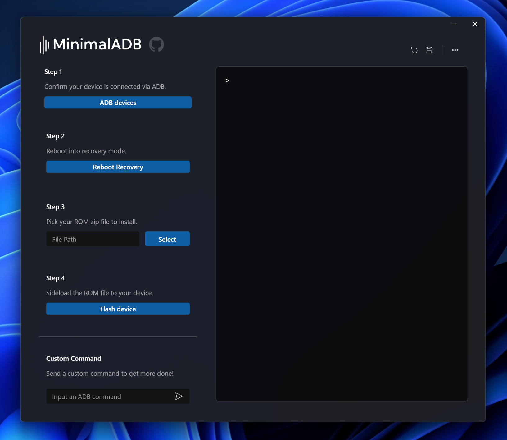

# MinimalADB

MinimalADB is a GUI based ADB interface, dedicated for flashing Android devices over ADB (Android Debug Bridge).
This is a modernised version of [yadev64/GMADB](https://github.com/yadev64/GMADB) using design principals of Microsoft's [Fluent-UI](https://developer.microsoft.com/en-us/fluentui#/).



## Development

-   Install dependencies

    ```
    $ yarn install
    ```

-   Run app in dev mode

    ```
    $ yarn run dev
    ```

-   Lint files

    ```
    $ yarn run lint
    ```

-   Perform typecheck

    ```
    $ yarn run typecheck
    ```

-   Run tests

    ```
    $ yarn run test
    ```

-   Build and package app

    ```
    $ yarn run build && yarn run package
    ```
